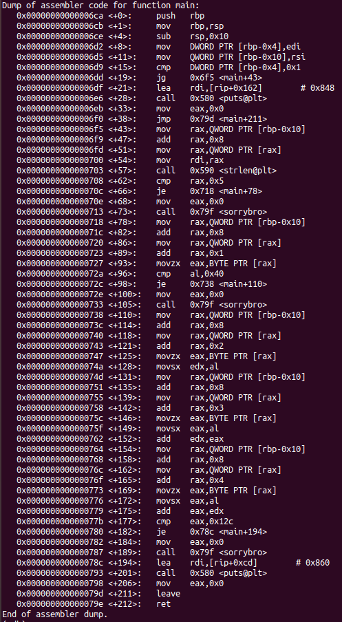

# Reversing-Challenge

So, we have this executable named glowwine.
Running it without any argument returns the following :
>usage: ./glowwine <key>
Running it with any random key, say 'aaaaa', returns:
>wrong key, try again :/
Now, to investigate further, I opened it with gdb. Disassembling the main gives us :

